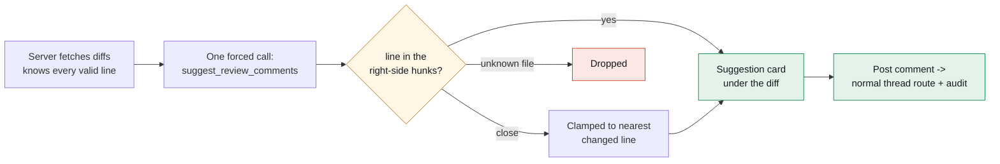

# Chat was the demo. Buttons are the product.

> Part 5 of the **ADO Companion** series. Part 3 built a tool-calling agent with propose-then-apply write gating; Part 4 gave it a flight recorder. This post is about what happened the first week of actually *using* it: the chat proved the capabilities, and then almost immediately stopped being where we wanted them.

> 📸 **Screenshot slot — HERO:** The PR drawer with AI review suggestion cards sitting directly under a diff — severity chips, Post comment / Dismiss buttons. The "in place" thesis in one image.

---

## TL;DR

A chat agent can review a PR, draft a work item, or explain a file — if you think to open the chat, describe what you want, and wait. In practice the moment of need is *inside* a screen: you're staring at a half-written work item, a diff, a file you don't recognize. So we kept the agent and added **three in-place AI surfaces**, all riding the same endpoint, tracing, and human-gating that the chat already had:

1. **Draft with AI / Improve with AI** on the work-item forms — a rough sentence becomes a complete item with acceptance criteria, *in the form*, where you still click Create.
2. **AI review** in the PR drawer — suggestions render as severity-chipped cards **under the diff they're about**, and a server-side trick makes hallucinated line numbers structurally impossible.
3. **Explain** on every file in the code browser — a plain-language "what this file is" panel written for the non-engineers who outnumber engineers in most orgs.

The design rule that made all three cheap: **new AI surfaces reuse the old guarantees.** Same model endpoint (a config value), same MLflow spans, same audit trail, same "nothing writes without a human click."

---

## 1. The observation

The copilot chat could already do these things. Ask it to "review PR 14" and it would list the files, read the diffs, and propose anchored comments. But watching real usage exposed the friction: the *trigger* for wanting a review is opening the PR — and now you're two tabs and a typed sentence away from the thing you already know you want.

The lesson generalizes: **chat is a great API for capabilities and a mediocre UI for moments.** The moments live in the screens. So each capability got a button where its moment happens.

---

## 2. Work items: the form is the human gate

The create drawer gets **Draft with AI**; the edit drawer gets **Improve with AI**. Type a title like *"genie slow, users complain"*, click, and the form fills in: a proper imperative title, a 3–8 line description, testable acceptance criteria, suggested tags.

The implementation is deliberately *not* the agent loop — it's one **forced function call**: the model must respond by calling a `suggest_work_item` tool whose schema *is* the form. No conversation, no tool-choosing, lower latency, and the parse has fallbacks for model quirks (structured call → text-form call → bare JSON).

The propose-then-apply question answers itself here, which is the elegant part: **the form is the gate.** The AI only fills fields; the human still clicks Create or Save. We didn't need to build approval UX because the approval UX already existed — it's called a form.

> 📸 **Screenshot slot:** The create drawer mid-flow — rough draft typed, then the same drawer after "Draft with AI" filled title/description/acceptance criteria/tags.

---

## 3. PR review in place — and the line-number trick

The PR drawer (Part 3's file/diff/thread viewer) gains two buttons: **AI review** in the header (whole PR) and **Review this file** under each diff. Suggestions come back as cards with a severity chip (`nit` / `suggestion` / `issue`), rendered **directly under the diff they refer to** — files with suggestions auto-expand and get a count badge. Each card has **Post comment** (which goes through the ordinary PR-thread endpoint — same audit row as a comment you typed) and **Dismiss**.

The part worth stealing is server-side. In the chat version, the model calls tools to fetch diffs itself. In the in-place version we flip it: **the server fetches the diffs, so the server knows the truth about them.** One forced function call returns `{path, line, comment, severity}[]` — and then the server *validates every line number against the actual right-side hunk lines of the unified diff it just handed the model*. A suggestion pointing at a line that isn't part of the change gets clamped to the nearest changed line; a suggestion for a file that wasn't in the diff gets dropped.

> 🖼️ **Diagram reading (for image generation):**
> A left-to-right pipeline. First box: **"Server fetches diffs — knows every valid line."** Arrow to **"One forced call: suggest_review_comments."** Arrow into an amber diamond: **"line in the right-side hunks?"** Three exits: **"yes"** goes to a green box **"Suggestion card under the diff"**; **"close"** goes through a small box **"Clamped to nearest changed line"** and then into the same green box; **"unknown file"** goes to a red box **"Dropped."** From the green card box, a final arrow to **"Post comment → normal thread route + audit."** Message: because the server owned the diffs, it can make hallucinated anchors structurally impossible before a human ever sees a card.

Why this matters: language models *will* guess line numbers, confidently. In the chat flow you mitigate that with prompts and verification tools; in the in-place flow you **eliminate the failure class** because the validator owns the ground truth. The "AI commented on line 123 of a 90-line file" bug cannot reach the UI.

One honest note: anchor validity and comment *insight* are different things. The plumbing guarantees the former; the latter scales with the model behind the config value — which is exactly why the endpoint is a config value.

---

## 4. Explain: the button for everyone else

Most people who open a code browser in a business tool are not engineers. The **Explain** button on every file produces a dismissible *"What this file is"* panel: 3–6 plain sentences plus key points, with a prompt that bans jargon and forbids quoting code. Binary files short-circuit without a model call.

This one was requested specifically for non-technical teammates, and it reframed how we think about the code browser: it's not a mini-IDE, it's a **shared artifact viewer** — and the AI's job there is translation, not review. (The same release gave the browser collapsible panes and a markdown Preview toggle, because a doc-reading mode was apparently what half the audience wanted all along.)

> 📸 **Screenshot slot:** The code browser with both side panes collapsed to rails, an Explain panel above a README rendered in markdown preview.

---

## 5. What made three surfaces cheap: the guarantees compound

Each surface took a fraction of the original agent's effort, because every hard problem was already solved once, centrally:

| Guarantee | Built once in | Reused by |
|---|---|---|
| Model endpoint as per-workspace config | Part 3 | all three surfaces, no redeploy to change models |
| MLflow span per call (now with token usage) | Part 4 | `ai.suggest`, `ai.review`, `ai.explain` |
| Audit row per AI action | Part 3 | `ai.suggest` / `ai.review` / `ai.explain` actions |
| Writes only via existing REST routes | Part 3 | review's Post button = the ordinary thread endpoint |
| Parse fallbacks for model quirks | Parts 3–4 | the shared extraction helpers |

That table is the real argument for building the agent's guarantees *as infrastructure* rather than as features of the chat: the second, third, and fourth AI features inherit them for free.

---

## 6. Lessons learned

- **Chat proves capabilities; buttons deliver them.** Ship the agent first — then follow the moments into the screens.
- **Move truth to the server and validate at the source.** The in-place review can guarantee things the conversational version can't, because the server owns the diffs it hands the model.
- **Forms are approval UX.** If the AI fills fields and a human submits, propose-then-apply comes free.
- **Design for the non-engineers early.** Explain cost an afternoon and may be the most-used AI button in the app.
- **Guarantees should be infrastructure.** Endpoint-as-config, tracing, audit, and gated writes were built once and inherited three times.

---

*Next in the series: the Reports tab — flow metrics for a data team, why every duration is in business days, and what replaced my d3 habit.*
