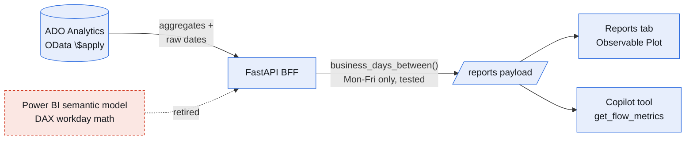

# Flow metrics for a data team

> Part 6 of the **ADO Companion** series. Part 2 chose OData as the analytics plane; this post finally spends that decision: a Reports tab of flow metrics for a high-velocity data science / data engineering / platform team — with two strong opinions baked in. Every duration is a **business day**, and every chart is drawn by **Observable Plot**.

> 📸 **Screenshot slot — HERO:** The full Reports tab in dark mode — KPI strip, created-vs-completed, cumulative flow, cycle-time scatter with p50/p85 bands, aging WIP with red danger dots, workload bars. This is the post.

---

## TL;DR

- **The metrics:** throughput, net flow, WIP, cycle time as a **scatter with p50/p85 bands** (never an average), a **cumulative flow diagram**, **aging WIP against the cycle-time bands**, workload by assignee, and a "needs attention" list. All server-aggregated via OData `$apply`, all filterable by range / type / assignee, all fetched in one round trip.
- **The unit:** business days, computed in our backend, because Azure DevOps Analytics only counts calendar days — a gap I used to paper over with a custom Power BI semantic model. That model is now retired.
- **The charts:** Observable Plot — the d3 team's successor library. ISC-licensed, bundled and offline, lazy-loaded, and themed entirely off the app's CSS design tokens, so dark mode came free.
- **The future report builder** got its foundation decision too: Databricks **metric views** verified working (created one, queried it with `MEASURE()`) as the governed semantic layer — with the visuals staying ours, always.

---

## 1. Which metrics, and why these

A data team's delivery questions are flow questions: *are we finishing what we start, how long do things really take, and what's silently stuck?* The tab answers exactly those, and deliberately avoids two traps.

**Trap one: averages.** Cycle time is a long-tailed distribution; the mean is a lie told by outliers. So cycle time renders as a **scatter — one dot per completed item** — with dashed **p50 and p85** bands. The p85 line is the honest promise you can make to a stakeholder: "85% of items like this finish within N days."

**Trap two: velocity theater.** Throughput without its counterweight invites gaming. It's paired with **net flow** (created minus completed — is the backlog growing or burning?) and a **cumulative flow diagram** from ADO's daily snapshots, where widening bands expose bottlenecks no standup ever mentions.

The chart I'd defend in a knife fight is **aging WIP**: every open item plotted by age *against the same p50/p85 bands from the cycle-time chart*. An item sitting above the p85 line is statistically already late — it turns red. That one view replaces the "anything blocked?" question in standup with a picture.

| Widget | Question it answers |
|---|---|
| KPI strip | The topline: completed, net flow, WIP, p50/p85 — in business days |
| Created vs completed | Are we keeping up? (bars vs step line — two flows, never stacked) |
| Cumulative flow | Where is work accumulating? |
| Cycle time scatter | What can we honestly promise? |
| Aging WIP | What's silently stuck *right now*? |
| Workload | Who is overloaded (and what's unassigned)? |
| Needs attention | The six oldest items, ranked, with owners |

Everything is aggregated server-side by ADO Analytics (`$apply=groupby/aggregate/filter`) with shared filters, and one backend endpoint gathers all of it concurrently — the tab costs one round trip.

---

## 2. Business days, or: retiring my Power BI semantic model

Azure DevOps Analytics helpfully computes `CycleTimeDays` and `LeadTimeDays` — in **calendar days**. For a team that works Monday to Friday, an item activated Friday afternoon and closed Monday morning did not take three days; it took one. Multiply that distortion across every weekend in a quarter and your percentiles are fiction.

My previous fix was a **custom Power BI semantic model** whose main job was DAX working-day math over the raw dates. Maintaining a separate BI artifact to correct a unit is exactly the kind of toil this app exists to delete.

The fix here is almost embarrassingly small: the BFF already fetches `CreatedDate`, `ActivatedDate`, and `ClosedDate` per item, so it computes **weekday-only durations** itself — a 20-line `business_days_between` with numpy-busday semantics and unit tests for the weekend-crossing edge cases. Every duration in the tab (cycle percentiles, WIP ages, the stale list) is business days; ADO's calendar values ride along in the payload for cross-checking; the AI copilot's flow-metrics tool speaks the same unit so chat answers match the charts.

> 🖼️ **Diagram reading (for image generation):**
> Left to right: a cylinder **"ADO Analytics (OData $apply)"** sends "aggregates + raw dates" to a box **"FastAPI BFF."** The BFF, annotated **"business_days_between() — Mon–Fri only, tested,"** produces a **"/reports payload"** which fans out to two boxes: **"Reports tab (Observable Plot)"** and **"Copilot tool (get_flow_metrics)."** Off to the side, a red dashed box labeled **"Power BI semantic model — DAX workday math"** points at the BFF with a dashed arrow labeled **"retired."** Message: one small, tested function in the backend replaced an entire parallel BI artifact, and both the charts and the AI now speak the same unit.

(Holiday calendars are the acknowledged v2 — a per-workspace list in the settings store. Weekends were 95% of the distortion.)

---

## 3. The visuals: what replaced my d3 habit

I came up on d3.js — the joy of owning every pixel, and the cost of writing forty lines per axis. The 2026 answer for people like us is **Observable Plot**, built by the d3 team as its successor: a concise grammar over d3's scales and shapes, with defaults good enough that most charts are one `Plot.plot({...})` call — and d3 still underneath when you want to get weird.

What sold it for a corporate-friendly, committed-to-git build:

- **ISC license** (MIT-family; d3 itself is ISC too) — no legal review drama.
- **A plain npm dependency**: bundled into our static build, zero runtime calls to any external service, no CDN, no telemetry. Works air-gapped. The name says Observable; the artifact is just a library.
- **Lazy-loadable**: Vite splits it into its own chunk (~130 kB gzip with d3) that loads only when the Reports tab first renders.
- **Trivially themeable**: a small `PlotFigure` host resolves the app's CSS design tokens at render time and re-renders on container resize *and theme flips* — so every chart got a correct dark mode for free, no second palette maintained.

The cycle-time scatter — dots, two dashed percentile rules with labels, tooltips naming each work item — is about fifteen lines of marks. In raw d3 that's an afternoon. The craft didn't go away; it moved up a level, into *which* charts to draw.

> 📸 **Screenshot slot:** Light-mode Reports next to dark-mode Reports, same data — the token-driven theming argument in one pairing.

---

## 4. The report builder gets its foundation: metric views, verified

The next phase is a self-serve report builder, and the question was what its semantic layer should be. Databricks **metric views** — YAML-defined measures and dimensions in Unity Catalog, queried with `MEASURE()` — were the candidate, pending one worry: would they work on the humble Free Edition dev workspace?

Verified, live: created a metric view over the ingested work-items table, queried it through the warehouse, got correct rows back. So the 4E plan is set: **definitions live in UC** (governed, versioned, visible to Genie and any other tool), the builder UI composes dimensions × measures × chart type, and the app renders the result with the same Plot components as the curated widgets.

Which resolves the question I actually cared about: *does the choice of semantic layer constrain the visuals?* **No — structurally no.** A metric view returns rows; a chart library draws rows. The data plane and the presentation plane meet at a tabular interface and owe each other nothing else. Pick the most governed data layer and the most beautiful chart layer; they will never fight.

---

## 5. Lessons learned

- **Percentiles over averages, distributions over summaries.** The p85 band is the only delivery promise worth making, and aging-WIP-vs-p85 is the best standup replacement I know.
- **Fix units at the source.** One tested function in the backend beats a parallel BI artifact maintained forever. If you're keeping a semantic model alive to correct someone else's unit, move that math into code you own.
- **Plot is the d3 upgrade path.** Same lineage, same control ceiling, a tenth of the ceremony — and token-driven theming makes dark mode a non-event.
- **Semantic layers and chart layers are decoupled by construction.** Choose each on its own merits.
- **Aggregate server-side, always.** Every widget is an OData `$apply` or a metric-view `MEASURE()` — the browser gets numbers, not rows.

---

*The series so far: built the app (1), chose the analytics plane (2), gave it an agent (3), gave the agent a flight recorder (4), moved the AI into the flow of work (5), and now taught it to measure the team honestly (6). The report builder is next.*
