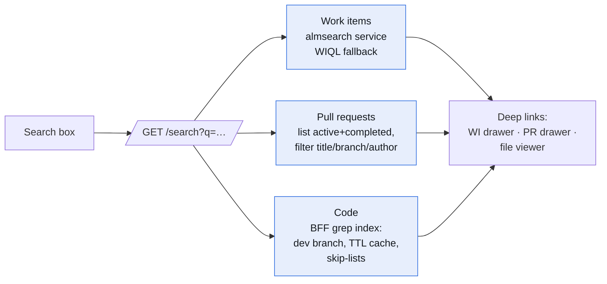
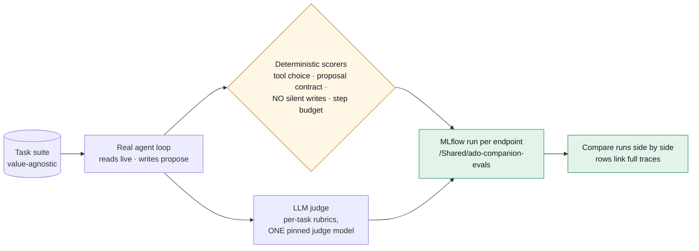

# The search box was a div

> Part 7 of the **ADO Companion** series. Part 6 taught the app to measure the team honestly. This post is about the day after: the gap between "feature-complete" and "finished" — and the harness that will decide which model runs the copilot in production.

> 📸 **Screenshot slot — HERO:** The header search dropdown mid-query — Work items, Pull requests, and Code sections visible, code results showing file paths with line-numbered snippets.

---

## TL;DR

- **The search box in the header had never worked** — it was a styled `
` wired to nothing. It's now a real global search over three planes in one round trip: work items (ADO's search service, WIQL fallback), pull requests (list-then-filter — ADO's search service doesn't cover PRs), and **code** — which the BFF greps itself, because the org never had the Code Search extension and the API *silently returns zero results* rather than erroring.
- Every result **deep-links**: work item → its edit drawer, PR → the review drawer, file → the code viewer on the right branch.
- **Copilot chats persist** (per-user session table, autosaved with proposal outcomes so a restored chat knows what was applied), **reports export** as .xlsx and .pdf (fpdf2, deliberately not weasyprint), and Genie answers in chat become **downloadable artifacts**.
- The centerpiece: **an eval harness on `mlflow.genai.evaluate()`** — the same task suite through the real agent loop against any serving endpoint, scored by deterministic invariant checks plus LLM judges, one run per endpoint in an MLflow experiment. The corporate "Llama or Claude?" question gets answered by comparing two runs side by side.

---

## 1. Silent failure is the worst failure

The bug report was one line: *"whats up with the search? it doesnt work!"*

It couldn't work — the search box was decoration, a styled div with a magnifying-glass icon that no one had ever wired to anything. That's the honest confession. The interesting part is what happened when I wired it.

Work items were easy: Azure DevOps Services ships a work-item search service (`almsearch.dev.azure.com`) with relevance ranking and highlight snippets, and WIQL `CONTAINS` makes a serviceable fallback. But code search returned nothing — no error, just `{"count": 0, "infoCode": 6}` for every query. The **Code Search extension (`ms.vss-code-search`) was never installed** in the org, and the API's way of telling you is indistinguishable from "no matches."

I could have left an "install the extension" note. Instead the BFF greps the repos itself: list every file on each repo's `dev` branch, bulk-fetch the text contents into a TTL cache, skip the noise (lockfiles, binaries, `node_modules`, and — via a minified-output heuristic — the committed Vite bundles), and return line-numbered snippets. A personal org is list-then-filter scale; the module is a contained swap if the extension ever arrives.

> 🖼️ **Diagram reading (for image generation):**
> Left to right: a **"Search box"** feeds one endpoint **"GET /search?q=…"**, which fans out to three parallel planes: **"Work items — almsearch service, WIQL fallback"**, **"Pull requests — list active+completed, filter title/branch/author"**, and **"Code — BFF grep index: dev branch, TTL cache, skip-lists."** All three converge into **"Deep links: work-item drawer · PR drawer · file viewer."** Message: one round trip, three independent search planes (each can fail alone), and every result lands the user inside the existing screen for that thing.

Two details worth stealing. Each plane fails independently — a Genie outage or an ADO hiccup degrades one section of the dropdown, never the whole search. And results reuse the shapes the screens already render, so "open this result" is just handing the object to the existing drawer. The search feature contained almost no new UI surface.

> 📸 **Screenshot slot:** Searching `business_days` — code results with line numbers — then the same query's top hit open in the Code viewer on the `dev` branch.

---

## 2. Chats that survive, tables you can keep, reports you can hand over

Three smaller ships rode the same day, all reusing infrastructure from earlier parts:

- **Copilot session history.** Chats autosave to a per-user Delta table after each answered turn — *including proposal outcomes*. That last part matters: when you restore a chat, the model's context says which proposals were applied and which were dismissed, so the conversation resumes truthfully. The UI is a row of session chips: new, restore, delete.
- **Genie answers as artifacts.** When the copilot's analytics tool returns a table, the reply now carries it and the UI offers a one-click `.xlsx` download. The generic table-export endpoint will outlive this feature.
- **Reports exports.** The Reports tab exports `.xlsx` (five sheets) and `.pdf` (an A4 one-pager: KPI strip + tables), honoring the active filters. The PDF library choice was a deployment decision, not a typography one: **fpdf2 is pure Python**; weasyprint wants system cairo/pango, and a pip install that fails at deploy time blocks every future deploy, not just the PDF button.
- **Report-builder filters.** The 4E builder gained filter chips per category dimension — distinct values queried from the metric view itself, selections bound as SQL parameters server-side, persisted inside saved report definitions.

The through-line from Part 5 holds: every one of these was cheap because the guarantees — store degradation contract, audit actions, parameterized SQL, propose-then-apply — were built once as infrastructure.

> 📸 **Screenshot slot:** The Copilot screen with session chips above the chat and a "⇩ …xlsx" artifact chip under a Genie answer.

---

## 3. The eval harness: swapping models without vibes

The plan has always been to run the copilot on a stronger model in the corporate workspace — the endpoint name is a secret, so the swap is one `put_secret`, no redeploy. The question was never *how* to swap; it was *how to know we should*. "It feels smarter" is not an answer you take to a platform team.

So the last ship of the day was `scripts/eval_copilot.py`, built on **`mlflow.genai.evaluate()`**:

- A **fixed task suite** runs through the *real* agent loop — live read tools execute against ADO, write tools become proposals exactly as in production. Nothing mutates. The tasks are value-agnostic: they assert *behavior*, never row counts that drift with live data.
- **Deterministic scorers** check the invariants that must not regress: the expected tool was called; a write ask became the right proposal with the right args; an update against a work item that doesn't exist was *rejected*, not proposed; **no write tool ever executed**; the agent stayed within its step budget. Latency logs as mean and p90.
- **LLM judges** score what code can't: per-task rubric strings — *"durations must be in business days"*, *"must say historical numbers are batch, not real-time"*, *"must not claim the item was created"* — evaluated by a judge model via MLflow's `ExpectationsGuidelines` scorer.
- Each invocation is **one MLflow run per endpoint** in a dedicated experiment. Comparing Llama and Claude is: run the script twice, open the evaluation UI, read two columns of numbers. Every row links its full trace from Part 4's instrumentation.

> 🖼️ **Diagram reading (for image generation):**
> A cylinder **"Task suite — value-agnostic"** flows into **"Real agent loop — reads live · writes propose."** The loop's output splits to an amber diamond **"Deterministic scorers: tool choice · proposal contract · NO silent writes · step budget"** and a box **"LLM judge — per-task rubrics, ONE pinned judge model."** Both feed a green box **"MLflow run per endpoint (/Shared/ado-companion-evals)"**, which leads to **"Compare runs side by side — rows link full traces."** Message: hard invariants are checked by code, soft qualities by a judge, and the unit of comparison is an MLflow run, not an impression.

Two rules the harness enforces by convention, written into the runbook because they're the two ways to fool yourself:

1. **Pin one judge model across every run you compare.** Different judges produce incomparable scores, and a model grading its own homework grades generously. Use the strongest model as judge even when it's also a contestant — the bias is at least symmetric.
2. **Deterministic scorers are a hard gate, not a weighted factor.** An endpoint that ever executes a silent write or proposes against a hallucinated id is disqualified. Judge scores and latency only rank the models that pass.

The dev baseline is already logged: Llama 4 Maverick passes the current six tasks clean at ~7s mean latency. Which exposes the suite's real job going forward — when both contestants score 1.0, the suite is too easy, not the models equal. The tasks grow until the scores separate.

> 📸 **Screenshot slot:** The MLflow evaluation UI with two runs selected — scorer columns side by side, one row expanded showing the judge's rationale and the linked trace.

---

## 4. Lessons learned

- **APIs that return empty instead of erroring will burn you.** The missing Code Search extension looked exactly like "no matches." When a plane can be unavailable, make the response say so — every search plane now carries an explicit `available` flag.
- **Owning the fallback beats requiring an install.** A TTL-cached grep index is unglamorous and it shipped the same night; the marketplace extension remains a contained upgrade.
- **Choose libraries by their failure mode at deploy time.** fpdf2 over weasyprint wasn't about typography — a pure-Python dependency can't brick the deploy pipeline over missing system libraries.
- **Persist outcomes, not just messages.** A restored chat that doesn't know which proposals were applied would resume by lying to the model.
- **Model choice is an eval run, not a debate.** Deterministic invariants as a hard gate, one pinned judge for the soft qualities, one MLflow run per endpoint — the corporate model swap is now a reading exercise.

---

*The series so far: built the app (1), chose the analytics plane (2), gave it an agent (3), gave the agent a flight recorder (4), moved the AI into the flow of work (5), taught it to measure the team honestly (6), and now finished the unfinished — and built the scale that weighs the models (7).*
