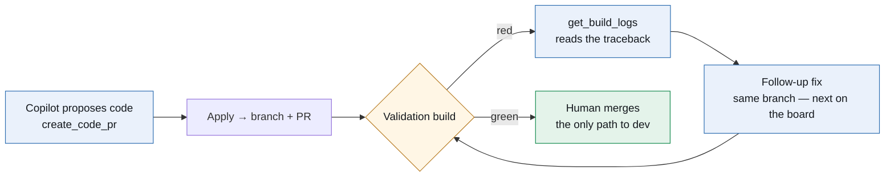

# The app runs its own project now

> Part 8 of the **ADO Companion** series. Part 7 built the scale that weighs the models. This post is about closing two loops at once: the agent learning to read *why its own build failed*, and the project's backlog moving into the very boards the app was built to manage.

> 📸 **Screenshot slot — HERO:** The Pipelines tab with a failed build expanded — stage/job/step timeline on the left rail of the row, the failed `pytest` step auto-selected, its log tail below with the `##[error]` line in red.

---

## TL;DR

- **The Pipelines tab now shows logs.** A build row expands into the build's stage → job → step timeline (durations, error badges); click a step and its log renders inline, `##[error]` lines in red, timestamps stripped. A failed build auto-opens its first failed step's log — the traceback is one click from the build list. No more jumping to the ADO web UI to find out why CI is red.
- **The same primitive is a copilot tool.** `get_build_logs` hands the agent the timeline plus each failed step's log *tail* — which matters, because tracebacks live at the *end* of a log. This is the missing half of the CI-feedback loop: an agent that opens PRs can now read why its own PR's validation build failed.
- **The backlog left the markdown files.** The whole roadmap — corporate rollout, the CI-feedback loop, Genie Code bridge, blog, polish, open-sourcing — is now **Epics and Issues on the ADO board**, created through the same REST plumbing the app uses. The to-do list lives in the tool that manages to-do lists. Radical, I know.
- Next on the board (as a work item, naturally): **tickets that close themselves** — link the copilot's PR to its work item, and let ADO's `transitionWorkItems` completion option move it to Done when the human merges. The AI never closes a ticket; your merge does.

---

## 1. A failed build should be one click from its traceback

The Pipelines tab had been the app's least ambitious screen since Phase 1: a list of builds with a colored dot. Green dot, fine. Red dot — open a browser tab, navigate the ADO UI, click into the build, click into the timeline, find the step, open the log. The app's north star is *run everything through it*, and the most common "leave the app" moment was exactly this one.

Azure DevOps splits the answer across two endpoints. `GET /build/builds/{id}/timeline` returns the build's execution tree — flat records with parent links, four levels deep (Stage → Phase → Job → Task), each carrying a state, a result, error counts, per-step issue messages, and — the important part — a `log.id`. `GET /build/builds/{id}/logs/{logId}` returns that log as plaintext.

Two small decisions made the UI worth having:

- **ADO's "Phase" layer is hidden.** The API's tree has a bookkeeping level between Stage and Job that no human thinks in. The renderer walks through Phase records transparently — you see stages, jobs, steps, like the YAML you wrote.
- **A failed build opens on its evidence.** Expanding a red build auto-selects the first failed step that has a log and shows that log immediately, with its error annotations (`##[error]`, the step's issue messages) highlighted. The common case — *why did it fail?* — takes zero additional clicks.

> 📸 **Screenshot slot:** A succeeded build expanded for contrast — all-green timeline, a step's log open showing ordinary section output.

The subtle one is in the backend: **log truncation keeps the tail, not the head.** Build logs open with minutes of dependency installation; the traceback is the last forty lines. A file viewer truncates the end; a log viewer must truncate the beginning. It's one slice expression — `text[-max_chars:]` — and it's the difference between "log truncated, error not shown" and the actual assert.

## 2. The agent gets the same eyes

Part 3's rule still holds: every capability lands twice, once for the human and once for the agent, on the same client methods. So the same session that built the tab gave the copilot `get_build_logs`: the timeline summarized (Phases dropped, issues attached), plus the log tail of each failed step, sized to fit the agent loop's tool-result budget. Pass a `logId` and it reads one specific log deeper.

This is the piece the coding agent was missing. Since Part 7's close, the copilot can search the org's repos, read files, and propose multi-file changes that Apply into real PRs — but when the validation build went red, the agent was blind. It had opened a PR it couldn't see fail. Now the loop reads:

> 🖼️ **Diagram reading (for image generation):** Blue boxes are the AI: **"Copilot proposes code (create_code_pr)"** → **"Apply → branch + PR"** → an amber diamond **"Validation build."** On red, the AI path continues: **"get_build_logs reads the traceback"** → **"Follow-up fix, same branch — next on the board"** → back to the build. On green, a single green box: **"Human merges — the only path to dev."** Message: the machine iterates against CI; the human remains the sole gate into the trunk.

One arrow in that diagram is still dashed in reality: pushing the follow-up fix to the *same* branch (today every Apply mints a fresh branch and PR). That's deliberately the next work item — and where it lives is the other half of this post.

## 3. The backlog moves into the product

For eight posts the project's plan has lived in markdown — a `NEXT_SESSION.md` handoff, a `PLAN.md` roadmap, numbered lists maintained by whichever session was awake. Meanwhile the app being planned is, literally, a work-item management client. The irony finally became actionable: **the roadmap is now on the board.**

Six Epics — corporate rollout, the CI-feedback loop, the Genie Code bridge, the blog series, app polish, open-sourcing — with the actionable cuts as Issues underneath, each description pointing at the runbook that specifies it, each priority set, everything tagged. The evening's planning conversation (sprints, teams, richer work-item panels, auto-close) went in the same way: Issues with child Tasks, parented under the right Epics. Created through the same REST endpoints the app's own drawers call.

The wins are the boring, structural kind:

- **One place.** "What's next" is a board query, not an archaeology of markdown bullets across two files. The handoff doc now says: *work the board, not this list.*
- **The app displays its own plan.** Open the Work Items tab and the product's roadmap is the demo data. Every feature built for the backlog — filters, drawers, flow metrics, the copilot's work-item tools — now exercises against real, load-bearing items.
- **PRs and tickets meet.** The pipeline-logs PR is linked to its work item, which tracks it in the item's Development section. Sprints (dated iterations, a current-sprint filter, burndown on the Reports tab) and teams (area-path-scoped boards for the corporate org) are specced as work items too — the plan for improving the planning tool is managed by the planning tool.

> 📸 **Screenshot slot:** The Work Items tab showing the seeded backlog — Epics and Issues with priority and tags visible, the roadmap as live data.

## 4. Tickets that close themselves (designed, not yet shipped)

The wish, verbatim: *"I wish the AI could just close the associated tickets."* The obvious implementation — give the agent a close-ticket tool — is wrong, for the same reason the copilot has no merge tool. The series' spine is *the AI writes; it cannot ship*. Closing a ticket is a shipping act: it asserts to every board, burndown, and velocity chart that the work is done.

ADO has a native mechanism that satisfies the wish without granting the power. A pull request can be **linked to work items**, and completed with `completionOptions.transitionWorkItems: true` — ADO itself then moves every linked item to its closed state *when the PR merges*. So the design, sitting on the board as three Tasks:

- `create_code_pr` proposals gain an optional `workItemId`; Apply links the new PR to the ticket (verified to exist first, like every write target since Part 3).
- The Merge button — human-only, gated on ADO's approval status — sends `transitionWorkItems`.
- The copilot says what will happen: *merging this PR will close AB#17.*

The AI proposes the association. The human merges. ADO closes the ticket. Nobody gained a capability; the loop just stopped leaking bookkeeping.

---

## 5. Lessons learned

- **Truncate logs from the front, files from the back.** Where the interesting bytes live is a property of the artifact, not a constant. One default hid every traceback it was built to show.
- **Flatten the API's tree to the user's tree.** ADO's Phase layer is real to the API and noise to everyone else. Render the hierarchy people wrote in their YAML, not the one the service persists.
- **Build the human view and the agent tool in the same commit.** They share one client method, one test fixture, one mental model — and the agent inherits every parsing decision the UI already litigated.
- **Dogfooding is a forcing function, not a stunt.** The moment the roadmap became work items, every rough edge in the work-item UX became a personal problem — the minimal side panels got specced for enrichment within the hour.
- **When someone wishes the AI had a power, look for the design where nobody needs it.** Auto-close-on-merge grants the outcome without granting the capability. Those designs compose; new tools don't.

---

*The series so far: built the app (1), chose the analytics plane (2), gave it an agent (3), gave the agent a flight recorder (4), moved the AI into the flow of work (5), taught it to measure the team honestly (6), built the scale that weighs the models (7) — and now it diagnoses its own builds and manages its own backlog (8).*
